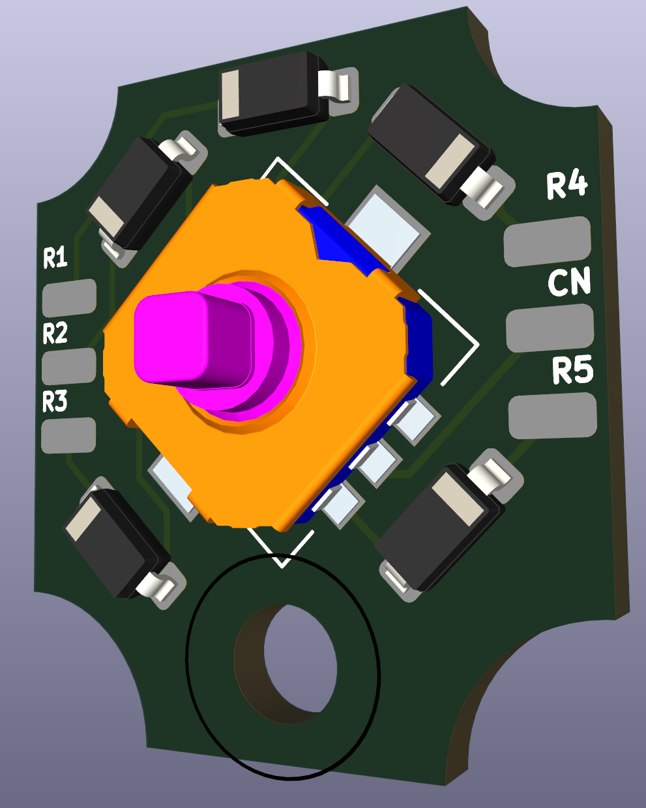
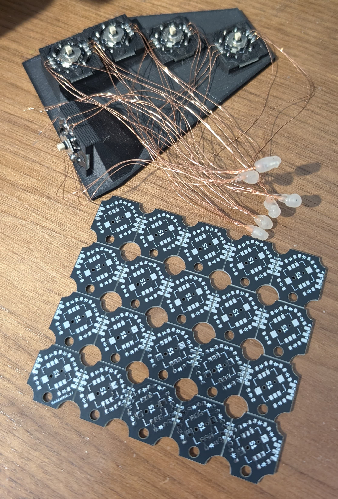

# SKRHADE010 Single PCB
These PCBs were designed to iterate on a [dactyl design mounting these switches](https://github.com/jonboh/skyl_prototype).

These switches can be acquired in [Mouser](https://eu.mouser.com/ProductDetail/688-SKRHAD) and probably other electronic component stores.

The file [skrhade_fabrication.zip](./skrhade_fabrication.zip) can be used to
order a set of these. Note however that design i not very good, in the effort
of making the footprint as small as possible I did not realize that the wiring would be much easier
if there were pads for each point (R1, R2, R3, R4, R5, CN) on both sides. Otherwise you need a common
point for all switches. I fixed this by soldering all wires to a central point and using hot glue as
insulator.

I did not continue with the Skyl project, otherwise I would have
made the change in the design and ordered a new set.

If you want to continue with the design, I would advise adding a bit more vertical space to the PCB
and adding the missing pads of both sides, wiring will be much easier, and similar to the [single
pcbs](https://github.com/jonboh/amoeba-cherry-ulp?tab=readme-ov-file#back) used in keyboard desings with typical switches.

This project was inspired by the [harite](https://github.com/dlip/harite), I used its footprints for the single PCB.
